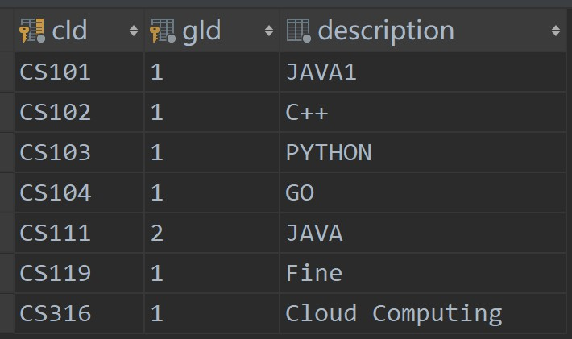
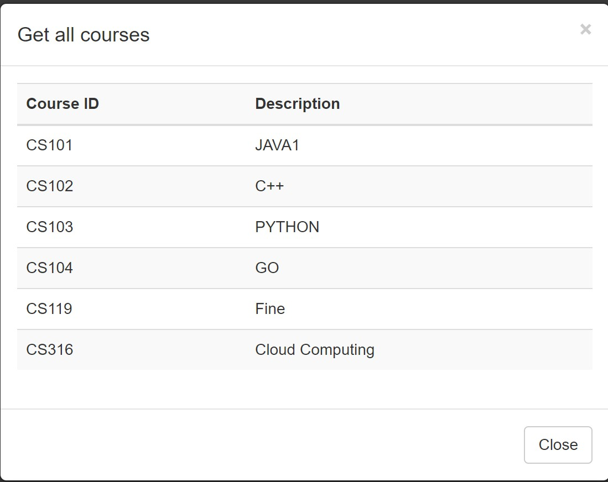
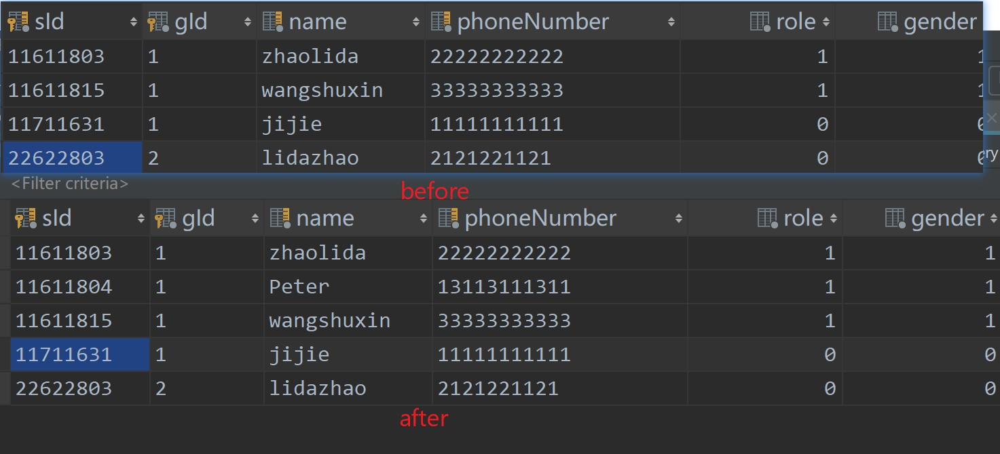

# DISTRIBUTED AND CLOUD COMPUTING

<b>REPORT</b> LAB ASSIGNMENT:  5

Student Name: Lida Zhao

Student ID: 11611803

Student E-mail: 11611803@mail.sustc.edu.cn

### Before reading

If you want to test the App by your self, please visit <http://193.112.53.42:8090/index>

Test account: 

1. admin(school id: 11711631 gid:1 pass:123456)
2. student(school id: 11611803 gid:1 pass:123456)
3. admin(school id:22622803 gid:2 pass:123456)

note: 

**school id** is the student or admin id of a certain school. 

**gid** is the group id. Usually, each school is a group. This is a String, thus, you can freely register this part as the school name. Here, gid=1 is just to facilitate test. 

## Education administration system design

### Basic function design

In my education administration system, there are 2 kinds of characters: student and administrator. 

**Student** can:

- login/logout
- change password
- view all the available courses
- select courses
- view all the selected courses

While **admin** can:

- login/logout
- change password
- view all the available courses
- add user, both students and other administrator
- add courses and their description

### Basic security design

1. Every access will have an session, in which saves the user information including  `role` (students or admin), `sid`, etc. When a specific URL is acquired, the system will first check the session information and the privilege. For instance, only admin can add user or course, only student can select a course.

2. User's passwords are stored in a separate table and is well encrypted. 

   

### Program implementing design

1. I strictly followed the MVC (model-view-controller) model. There are 3 models: `UserModel`, `CourseModel`, `GradeModel`. Correspondingly, there are 3 `controllers` and three `services`. Up on such structure, the program is easy to extend. If I have time, I can fully implement all the user logics of a education administration system.

2. The class diagram is shown below:

   Control layer

   Model layer

   

   Data objects

   

   

Service layer		

## SaaS design 

1. For each `group`, if they want to use our service, they should send a request to us for an `admin`  account and their own `gid` (group id). Then, they can use the admin account to create courses as well as adding students or other admins.
2. In the database, as you can see, different group's data are separated by different group id. This group id is determined when the  user login. Each following operation will verify the group id to make sure the user didn't get access to the wrong data.

## Problems

1. This is really a big project that we have to deal with front end, back end, data transition between front end and back end as well as deploy it on the cloud. I have never done them by I own. The hardest things is to learn a grate amount of new things in limited time and used immediately. This is a great challenge, but I made it.
2. When I do data transition between front end and back end and there is an **cross origin** problem which takes me a long time. I finally solved it by adding some configurations.

## Demonstration

We will check all the functions in a single group, and then, we check the data access in another group.

- First, you will see a login page

  

- Then you need to put the user info. If your `role` is student, it will automatically jump to student page; If you are admin, vise versa. Now lets' login using a admin id.

  

- We can see there are several options there. Lets checkout their function as well as their influences one by one.

  - change password

    

    

  - get all available course

    

    

    

  - add user

    

    

  - add courses

    

    

  - logout: once apply this, the page will jump back to the log in page

- Now let's log out and use a student id to login

  - login

    

    

  - get all class, all selected class 

    

    

  - select a course

    

  - change pass word

    The same as the admin's **change pass word**

  - Log out

    The same as the admin's Log out

- Then let's check whether the data access is correct if we change to another group

  

- As we can see, there are only 1 course belongs to group 2, so group 2's admin only get 1 available course. Data is separated.

## Quality

1. UI quality

   The UI pages are developed using **BOOTSTRAP**.

2. Code quality

   My code strictly followed MVC design model, which means it has a high extendibility and maintainability.